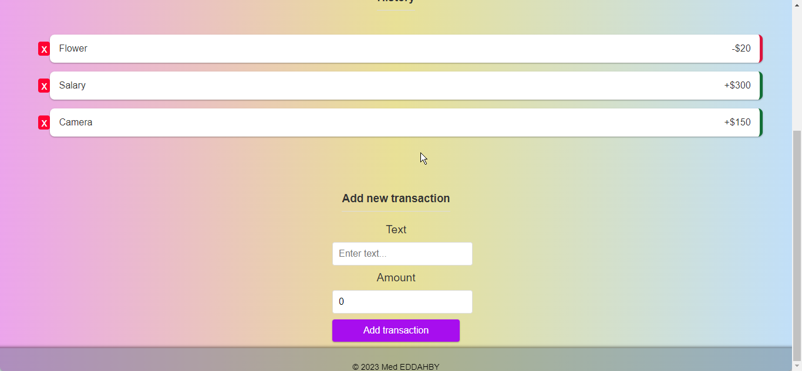

# Expense Tracker

**An intuitive Expense Tracker application built with React for the frontend, Redux for state management, and a Node.js backend with MongoDB for data storage.**

## Features

- **User-friendly Interface:** Easily manage your expenses with a simple and intuitive interface.
- **Transaction Handling:** Add, edit, and delete transactions to maintain a clear overview of your financial activity.

- **Redux State Management:** Efficient state management for a seamless user experience.

## Installation

1. **Clone the Repository:**

   ```bash
   git clone https://github.com/MedEddahby/-expence-tracker.git
   cd -expence-tracker
   ```

2. **Install Dependencies:**

   ```bash
   npm install
   ```

3. **Run the Application:**
   ```bash
   npm start
   ```

## Usage

1. **Transaction Management:**

   - Add new transactions and categorize them.
   - Edit or delete existing transactions for accurate financial records.

2. **Live Demo:**
   - Explore the live demo to experience the user-friendly features. [Live Demo([[https://mededdahby.github.io/-expence-tracker/](https://mededdahby.github.io/expense-tracker/)

## Screenshots:

| Home                            | Add new expenses            |
| ------------------------------- | --------------------------- |
|  |  |

## Contributing

If you'd like to contribute to this project, feel free to fork the repository and submit a pull request. You can also open issues for bug reports or feature requests.

## License

© 2023 MedOx EDDAHBY

This project is licensed under the MIT License - see the LICENSE file for details.

🚀 Happy expense tracking! 📊💸
